<section class="cover">

GUÍA HACKGIRLS - FRONT DAY


</section>
<section>

#Introducción

En Chile, A nivel urbano nacional, el 20% de las mujeres ocupadas en Chile son “trabajadoras por cuenta propia”, según la encuesta Voz de Mujer (cifra que coincide con la entregada por la última Casen). En tanto, solo el 3% son “patrón o empleadora”, lo cuál correspondería a empresarias.

El propósito de Emprededoras.club es cambiar esta realidad, a través de la entrega de conocimientos y herramientas que faciliten la creación de empresas y tecnología.

Front Day es un evento con el objetivo de entregar conocimientos básicos de programación web a mujeres programadoras para que puedan construir y supervisar la construcción de las páginas web de sus empresas.

#Qué se necesita para este taller:
Un navegador web y un editor de texto.
Descarga Sublime Text [aquí](https://www.sublimetext.com/).

Para el evento solo necesitas un navegador y un editor de texto.

Cómo navegador puedes ocupar alguno como:

- Firefox
- Safari
- Chrome

Cómo editor de texto te recomendamos:

- [Sublime](https://www.sublimetext.com/)

- [Atom](https://atom.io).

#Qué es una página web

De entrada podemos preguntarnos qué es una página web. Habrían dos respuestas: para el **usuario** y para el **diseñador**.

Para el **usuario** una página WEB es una pantalla en su monitor que le muestra la información que va buscando y enlaces a otros sitios relacionados.

Para el **diseñador** una página WEB es un documento construido para mostrar información en la pantalla de un monitor, que contiene además de la información una serie de instrucciones para indicar como se ha de mostrar esa información. Estas instrucciones se escriben siguiendo un lenguaje llamado HTML.

Una serie de páginas web interconectas e interrelacionadas de alguna forma (el mismo tema, el mismo objetivo...) forman un sitio web, que habitualmente está almacenado en un servidor.

#Creando nuestra primera página web:

Vamos a crear un proyecto totalmente desde cero.

Para eso vamos a crear una carpeta nueva en el escritorio. Le puedes llamar como tu quieras, como por ejemplo "proyecto web".

Luego abrimos la carpeta  "proyecto web" en Sublime Text (tu editor de texto).

- Puede ser arrastrando la carpeta hacia el editor de texto</li>
- O abriéndola desde el editor de texto.</li>

Ahora creamos un archivo nuevo llamado index.html 
Esto se hace escribiendo index.html en la primera línea.

~~~html
index.html
~~~

*Cada vez que salga esta sintaxis en la guía, significa que debes escribir esto en Sublime Text (en el editor de texto).*

Luego guardamos (grabamos).

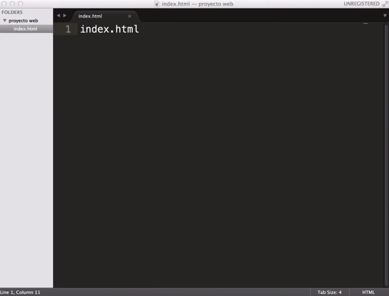

Una vez guardado, puedes borrar la primera línea. El archivo ya quedó guardado  como index.html.

¿Por qué llamar al archivo de inicio como index?
Porque es una convención, se subentiende que es el archivo índice que inicia una página web.

El que sea .html, dice que es un archivo que se interpretará como HTML.
Ahora este archivo puedes abrirlo en tu navegador haciendo click con el botón derecho sobre el nombre y eligiendo la opción "Open in browser"/"Abrir en navegador", pero antes de hacerlo escribe en él "hola a todos !!!".

~~~html
hola a todos !!!
~~~

Entonces al abrirlo en el navegador te debería aparecer algo como esto:


Felicidades!!	Ya estás escribiendo tu primera página web!!!

#¿Qué es HTML?
***

HTML es un simple código que es interpretado por el navegador web - como Chrome, Firefox o Safari - para mostrar una página web al usuario.

HTML significa "HyperText Markup Language" - en español, **Lenguaje de Marcas** de HyperTexto. **HyperText** significa que es un tipo de texto que soporta hipervínculos entre páginas. **Marcado** significa que hemos tomado un documento y lo marca con código para decirte cómo interpretar la página (en este caso, un navegador).

HTML es un lenguaje de **marcas**, cada una comenzando con `<` y terminando con `>`. Estas etiquetas definen **propiedades**, la **importancia** y el **significado semántico** del contenido que envuelven.


Una página web entonces es un archivo que contiene un conjunto de marcas ó etiquetas y que el navegador lee estos archivos HTML y con eso mostrar las páginas.

## Estructura de HTML

Un archivo HTML para poder ser interpretado correctamente deber tener una estructura. La estructura básica consiste en una **cabeza** (*head*) y un **cuerpo** (*body*), la cabeza contiene toda la información que es para el **navegador**, el cuerpo de la página contiene toda la información que es para el **usuario**. Dentro de las etiquetas HTML se encuentra todo el contenido de la página, y dentro de ellas están los dos bloques previamente mencionados.

La estructura de una página en HTML es la siguiente:

~~~html
<!DOCTYPE html>
<html>
<head>
	<title></title>
</head>
<body>
    <!-- Aquí va el contenido de la página web -->
</body>
</html>
~~~

El `doctype` (o tipo de documento) es la primera etiqueta que leeremos y le indica al navegador como debe interpretar el resto del documento. En el ejemplo veremos que el doctype especificado es de HTML5, el cuál es el estándar de hoy. 

La etiqueta `<html>` especifica que desde ese punto en adelante todo lo que venga deberá ser interpretado como HTML.

En HTML5 la etiqueta `<head>` puede ser omitida, en ese caso todo lo que esté antes de body será considerado como head. Por otro lado, esta es una etiqueta que especifica el contenido que se le entregará al navegador y que sea necesario para mostrar correctamente la página. Contendrá información variada, desde dónde encontrar las hojas de estilo o los íconos, hasta cuál es el título del sitio o sencillamente cómo debe manejar la página en el caso de que tenga que adaptarse a distintos tamaños de pantalla.


##El título
Muestra en el navegador el título de la página, se escribe entre las marcas `<title>` y `</title>` y tiene la función de ser una guía visual del contenido de la ventana o del tab del navegador.

~~~html
<!DOCTYPE html>
<html>
<head>
	<title> HACK GIRLS </title>
</head>
<body>
    <!-- Aquí va todo lo que quieras agregar -->
</body>
</html>
~~~


<div class=" info yellow">
Cabe destacar que Los bookmarks ocupan el título de la página cuando se guarda, además tiene mucho valor en el SEO de un sitio web.
</div>


##Codificación
Agregaremos la codificación (estándar que define el cómo se muestran las letras en el HTML) para que el navegador muestre los textos correctamente y entienda cuando hemos agregado una letra distinta, como por ejemplo la ñ. Para agregar esto hay que agregar la siguiente línea dentro de las marcas `<head>` `</head>` :

`<meta charset="utf-8">`

La página debería quedar así:

~~~html
<!DOCTYPE html>
<html>
<head>
	<title> HACK GIRLS </title>
    <meta charset="utf-8">
</head>
<body>
    <!-- Aquí va todo lo que quieras agregar -->
</body>
</html>
~~~

<div class=" info yellow"> Sin el meta charset los tildes y ñ (caracteres especiales) no se verán correctamente dentro de nuestro documento </div>

##Atributos y valores
En la etiqueta `<meta charset="utf-8">` vemos que hay algo nuevo que no habíamos visto en otras etiquetas, en primer lugar la marca no se cierra, y la regla es simple, si la etiqueta no tiene contenido no se cierra, y para pasarle valores adicionales se ocupan **atributos** y **valores**, donde `charset` sería el *atributo* y `utf-8` el *valor*.

Son diversos los atributos y valores que se pueden pasar a cada etiqueta, dos atributos muy importantes que estudiaremos más adelante son el **id** y la **clase**.

##Cabeza y cuerpo
La información de la página dentro del head es para el navegador, la información que está dentro del cuerpo es para el usuario. 

<div class="info yellow">
El navegador lee dentro de ambas etiquetas, pero las del head no las muestras, las ocupa para determinar ciertos parámetros, en cambio el body se lo muestra al usuario.
</div>

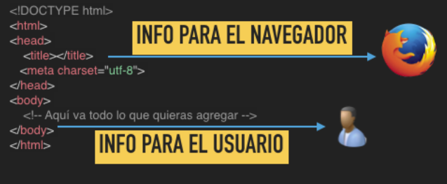


##Etiquetas Básicas:


*Todo lo que veremos desde ahora se debe escribir dentro del* **body** *(hasta que se indique lo contrario), por ende dentro de las etiquetas* `<body>``</body>`


###Párrafos:


Si escribes en el archivo index.html :

~~~html
<!DOCTYPE html>
<html>
<head>
	<title> HACK GIRLS </title>
    <meta charset="utf-8">
</head>
<body>

hola a todos !!!
hola hola hola
hola !!!

</body>
</html>

~~~

Al refrescar el navegador, éste te leerá de la siguiente forma:

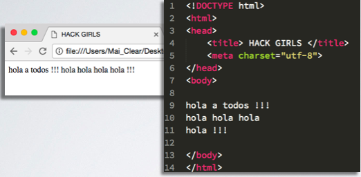

Si te fijas, el navegador no respeta la sintaxis de párrafos y se lee como si estuviera todo escrito en una misma línea.
Lo que pasa es que HTML es un lenguaje de marcas y para separar cada línea del texto y se pueda leer todo en varias líneas, deben de existir etiquetas de por medio.
Vamos a aprender la primera etiqueta y la más sencilla de todas: `p`.

Se abre con `<p>` y debido a que contiene información se debe cerrar con `</p>`.
Todo el contenido que se encuentre dentro de estas marcas pasa a tener la **propiedad de párrafo**.
Por ejemplo, escribamos esto en nuestro archivo index.html:

~~~html
hola a todos !!!
hola hola hola
hola !!!

<p> Hola a todos </p>

<p> Este es mi segundo párrafo </p>
~~~
*No olvidar que esto se escribe dentro del body.*

Refrescamos el navegador y quedaría algo así:


Gracias a la etiqueta `<p>` Ahora **si** respeta que sea un párrafo!!!
Puedes agregar la cantidad y largo de contenido que quieras.

# Autocompletado con Sublime

En Sublime Text si se escribe "p" (o cualquier marca) y luego tab, se autocompleta la etiqueta por si sola. Para que este truco funcione es necesario que el editor tenga identificado el tipo de archivo, por defecto lo detecta por la extensión original, pero se puede cambiar en la parte inferior izquierda.

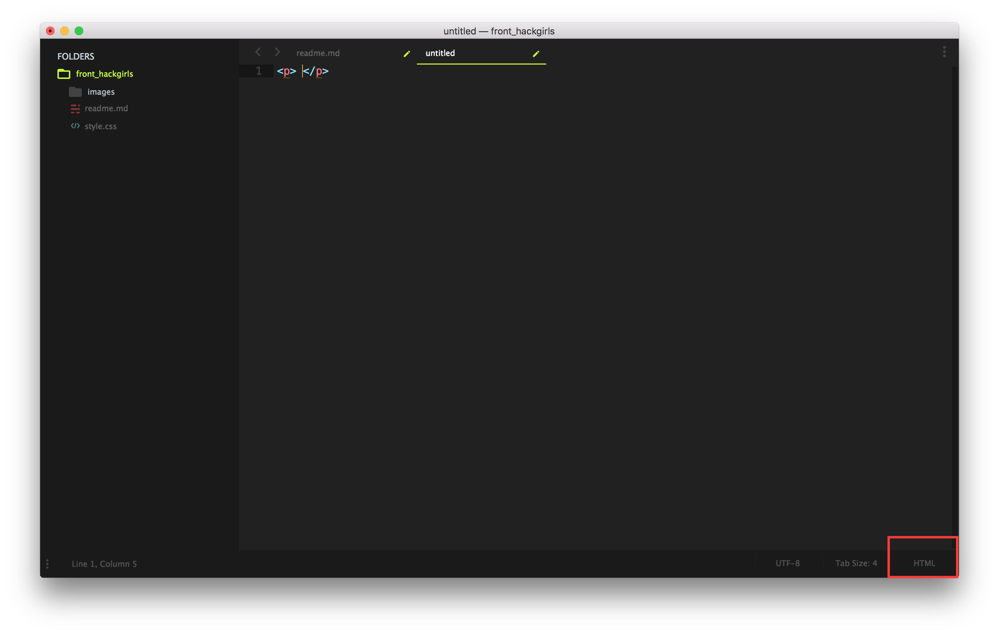


###Titulares (Títulos) y Sub titulares:

Una página web también tiene titulares, al igual que un periódico!

La marca para los títulares es `<h>` **más** un número del `1` al `6`. Siendo `<h1>` para el títular principal o con mayor importancia y `<h6>` para el subtítulo del subtítulo del subtítulo del subtítulo del subtítulo del título!

Por ejemplo escribamos en nuestro archivo index.html:

~~~html
hola a todos !!!
hola hola hola
hola !!!

<h1> Titulo 1 </h1>
<p> Hola a todos </p>

<h2> Sub titulo </h2>
<p> Este es mi segundo parrafo </p>

<h3> Sub sub titulo </h3>
<p> Este es mi tercer parrafo </p>

<h6> Sub sub sub sub sub titulo </h6>

~~~

Refrescamos el navegador y se debería ver algo como esto:

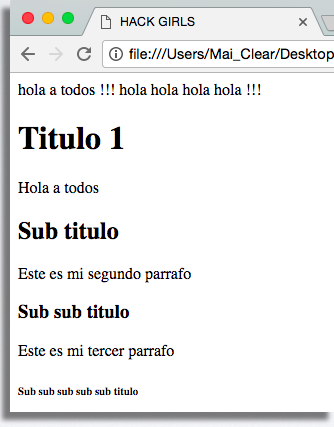

Se puede ver que el titular `<h6>` es muy pequeño, incluso menor que los párrafos.

### Imágenes:

La etiqueta para agregar imágenes es

~~~html

~~~

Donde `src` es *source* , que en español es fuente y que es un **atributo** de la etiqueta de imagen. `alt` es otro **atributo** de la etiqueta `img`, que te permite describir(brevemente) la imagen en caso de que no se pueda cargar por escasez de internet, o en navegadores de solo texto.
Esta etiqueta no necesita cerrarse como lo hacen las anteriores.

Para agregar imágenes utilizando esa etiqueta puedes hacerlo de dos maneras:
`-`Directo de una URL de internet.
`-`Desde una imagen desde tu proyecto (desde tu computador).

##### Imágenes Desde internet:

Buscas en el google la imagen que quieras, y luego haciendo click en "ver imagen" , ésta te llevará a una url terminada en .jpg o .png


Esa url debes copiarla y pegarla dentro de los `" "` del source

~~~html

~~~
Entonces si esto lo agregamos en nuestro archivo index.html:

~~~html
hola a todos !!!
hola hola hola
hola !!!

<h1> Titulo 1 </h1>
<p> Hola a todos </p>

<h2> Sub titulo </h2>
<p> Este es mi segundo parrafo </p>

<h3> Sub sub titulo </h3>
<p> Este es mi tercer parrafo </p>

<h6> Sub sub sub sub sub titulo </h6> 


~~~

Refrescamos el navegador:


#####Imágenes desde el computador:

Para esto debes crearte una carpeta **dentro** de tu proyecto llamada *images* y ahí ir integrando las imágenes que quieres en tu proyecto:

~~~
proyecto_web
└───index.html
	images
    └─── ejemplo.jpg
~~~

*Puede ser formato jpg, png, jpeg, ahí debes ver que formato es tu imagen. Importante que las imágenes estén en una carpeta que se llame images dentro de la carpeta de donde está tú proyecto*

En ese ejemplo yo estoy agregando una imagen a mi carpeta *images* con el nombre de *ejemplo* y de formato *.jpg*

Entonces para agregarla en mi web se copia la ruta de donde se encuentra mi imagen en el `src` de la siguiente manera:

~~~html

~~~

Donde *images* es el nombre de la carpeta donde se encuentra mi imagen + `/` + *ejemplo* (nombre de mi imagen) `.jpg`(formato)

###Links:

Los links se hacen con la etiqueta `<a>`:

~~~html
<a href=" "> </a>
~~~
Esta etiqueta tiene el atributo href que es hacia adonde apunta, y contenido que muestra el texto, ya que tiene contenido esta etiqueta **si** se cierra.

Veamos un ejemplo:

~~~html
<a href="https://www.facebook.com/events/2162321913993416/">Link al evento</a>

~~~
Aquí se está transformando a la frase *Link al evento* en un hipervínculo. Y al hacerle *click* en ella , te enviará al link escrito dentro de las `" "` del `href`


Por ende lo que hace esta etiqueta es darle la **propiedad de hipervínculo** al contenido de ésta, apuntándolo al link que se encuentra en `href`

Si pongo link sin `href`, no me llevará a ninguna parte. Y si al link no le pongo texto(contenido) ,pero si `href`, no se podrá ver el link por ninguna parte y por ende no se podrá hacer nada.

Si yo quisiera que el link me abriera en una página nueva, hay que agregarle a la etiqueta el **atributo** `target="_blank"`, quedando de esta forma:

~~~html
<a href="https://www.facebook.com/events/2162321913993416/" target="_blank" > Link al evento </a>
~~~

*Importante resaltar que todos los* **atributos** (`href` , `target`, etc...) *se escriben dentro de la etiqueta `< ... >` no fuera, ya que pasaría a ser texto.*

<div class="yellow">
Ahora trata de transformar una imagen en hipervínculo.
Si necesitas ayuda, no dudes en preguntar a tu mentor.
</div>

***

Hagamos un pequeño resumen de lo que hemos aprendido:

~~~html
<!DOCTYPE html>
<html>
<head>
	<title> HACK GIRLS </title>
    <meta charset="utf-8">
</head>
<body>


<h1> Evento Hack Rails </h1>

<h3>Por más mujeres en emprendimiento y tecnología</h3>

<p> Lorem ipsum dolor sit amet, consectetur adipisicing elit.
Ipsam consequuntur omnis minima dolorem adipisci officiis enim
optio tenetur quos aliquid, saepe, corporis dignissimos?
Harum debitis veritatis voluptas, illum iste deserunt.
Lorem ipsum dolor sit amet, consectetur adipisicing elit.
Quo dolorem dignissimos expedita repellendus ducimus natus
possimus, molestiae architecto, aperiam officiis, amet consequatur,
 nisi. Est accusamus eum quos natus architecto modi.</p>

<p> Si quieres saber más del evento haz click <a href="https://www.facebook.com/events/2162321913993416/" target="_blank" >aquí </a></p>


</body>
</html>

~~~

Esto se vería así:

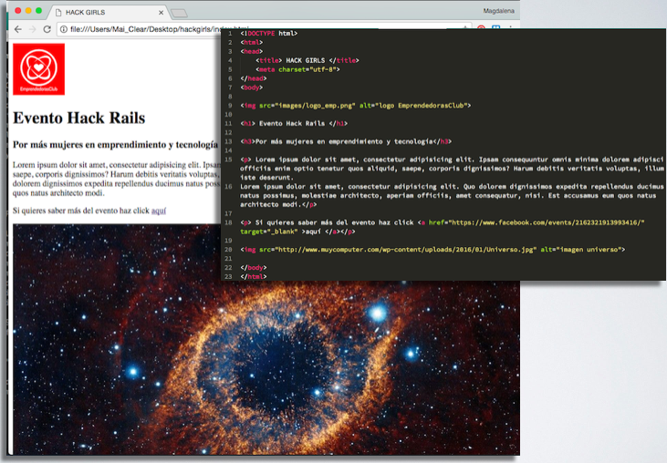


- Primero se está llamando una imagen que se encuentra dentro de la carpeta *images* y que se llama *logo_emp*.
- Luego se pone un título `<h1>`(Titular principal).
- Luego un sub sub título.
- Luego viene un párrafo con bastante texto.
- Luego un párrafo que a su vez con tiene un link (`<a>`).
- luego se llama a una imagen desde el internet.


### listas ordenadas:
Para definir una lista de elementos ordenados ocuparemos la etiqueta `<ol>`, pero dentro de esta lista debemos definir elementos, eso lo haremos con la etiqueta `<li>` 

Las listas ordenadas tienen un número o letra, esto lo modificaremos más adelante con CSS.

~~~html
<h3> Esta es una lista ordenada </h3>
<ol>
	<li> Lista 1 </li>
	<li> Lista 2 </li>
</ol>

~~~


###listas desordenadas:

Las listas desordenadas tienen bullets, esto también es modificable con CSS.
Para definir una lista de elementos desordenados ocuparemos la etiqueta `<ul>`, y dentro de esta lista debemos definir elementos, eso lo haremos con la etiqueta `<li>` 


~~~html
<h3> Esta es una lista desordenada </h3>
<ul>
  <li> Lista 1 </li>
  <li> Lista 2 </li>
</ul>
~~~
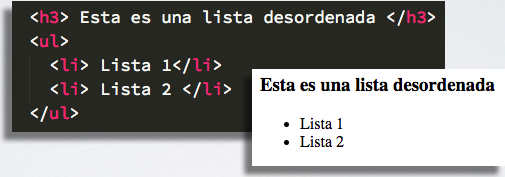
###Tablas

Es posible agregar tablas con datos ocupando la etiqueta `<table>`, dentro de una tabla debemos especificar las filas y las celdas dentro de las filas utilizando `<tr>` y `<td>` cada etiqueta tr especifica una nueva fila, y cada etiqueta td una celda.

~~~html
<table>
<tr>
<td> Celda 1</td>
<td> Celda 2</td>
</tr>

<tr>
<td> Celda 3</td>
<td> Celda 4</td>
</tr>

</table>
~~~

<table>
<tr>
<td> Celda 1</td>
<td> Celda 2</td>
</tr>

<tr>
<td> Celda 3</td>
<td> Celda 4</td>
</tr>

</table>
###Divs:
Los divs son etiquetas que permiten anidar a otras etiqueta y le damos estilo propio a la agrupación (esto lo haremos más adelante con CSS).
Envuelve varias etiquetas, y todas las etiquetas envueltas por él, están bajo la influencia del div.

~~~html
<div>
	<h1> Titular 1 </h1>
	<h2> Titular 2 </h2>
	<p> Párrafo 1 </p>
</div>
~~~

###Span:

La etiqueta span es similar a los divs pero sirve para etiquetar texto, una parte de una palabra, una palabra o más. (luego con CSS, hace más sentido, por ahora es bueno que la conozcas)

~~~html
<p> Lorem <span> Ipsum </span> </p>
~~~


##El inspector de elementos
El inspector de elementos, es una herramienta que podemos abrirla haciendo click derecho sobre la página y luego inspect nos muestra el código completo de la página y nos permite modificarlo. Con esta herramienta pueden ver el código de cualquier página web. 

Puedes aprender más sobre él [aquí](https://developer.mozilla.org/es/docs/Tools/Page_Inspector)


<div class="yellow">
Juega un rato con él, inspecciona lo que llevas de tu página, y mira sitios de tu interés.
</div>

##Encontrando errores en una página web
Una buena herramienta para detectar errores en tu página es w3c validator. Tiene diversas formas de validar, nosotros ocuparemos **Validate by direct input**, ahí podemos copiar el contenido de nuestra página y ver si hay errores de algún tipo.


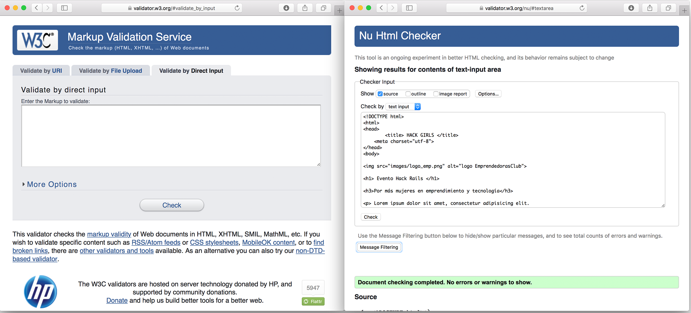


***
Ahora vamos a saltar al diseño de nuestra página web, luego continuaremos con más html.

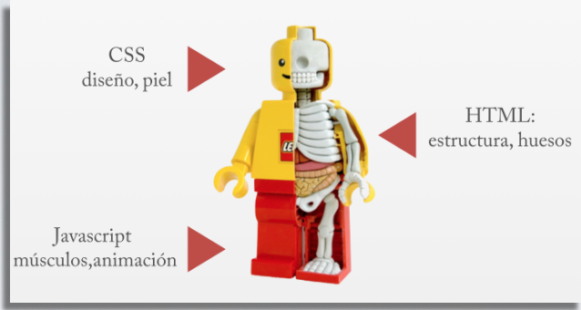

Nosotros estábamos aprendiendo HTML, que vendría siendo el esqueleto de nuestro sitio web, ahora le añadiremos la "piel", el diseño, y eso lo hacemos con CSS.

#¿Qué es CSS?

CSS es acrónimo de Cascading Style Sheet, o sea hojas de estilo que se pueden incorporar dentro de HTML para darle forma y color a nuestra voluntad.

Hay tres formas de incorporar CSS dentro de una página web.

- La primera es con un conjunto de atributos y valores dentro de la etiqueta del mismo HTML.

- La segunda consiste en agregar el CSS dentro del head del mismo documento HTML.

- La tercera forma consiste en utilizar un archivo externo.

La forma recomendada de trabajar es la 3º, pero para explicar como funciona CSS partiremos ocupando la primera forma.

#Sintaxis y primera forma
Todas las instrucciones en CSS se escriben en pares propiedad: valor, para agregar CSS sobre una etiqueta HTML (Primera forma) debes agregar a la etiqueta syle="propiedad: valor"

## Un ejemplo: color para un párrafo

~~~html
<p style="color: red"> </p>
~~~

Intenta cambiar ahora el color de Body

#Agregando CSS en el head
La segunda forma de agregar CSS consiste en agregar las propiedades y valores de CSS dentro de una etiqueta style en el head de la página

~~~html
<head>
  <style>
    p {
    	color: red
   	}
  </style>
</head>
~~~

##Sintaxis:
La sintaxis de css siempre tiene la siguiente estructura:

~~~css
etiqueta {
	propiedad: valor;
}
~~~

##Cargando un CSS externo:
La tercera forma para incluir CSS en una página web consiste en agregar un link a un CSS externo, con externo se refiere a fuera de la página, pero puede estar dentro del mismo servidor, o se puede cargar desde otro sitio.

Primero creamos un archivo nuevo, dentro de la carpeta de nuestro proyecto, llamado miestilo.css

~~~
proyecto_web
└───miestilo.css
	index.html
	images
    └─── ejemplo.jpg
~~~
El nombre no importa, lo importante es que sea `.css` para que sepa que estamos escribiendo CSS.

Para agregar un link a un css ocuparemos la etiqueta link dentro del `<head>`.

~~~html
<link rel="stylesheet" type="text/css" href="miestilo.css">
~~~

<div class="info yellow"> En Sublime Text si se escribe link y luego se autocompleta con tab, la línea para agregar un CSS externo se escribe sola. </div>

Quedando de esta manera:

~~~html
<!DOCTYPE html>
<html>
<head>
	<title> HACK GIRLS </title>
    <meta charset="utf-8">
    <link rel="stylesheet" type="text/css" href="miestilo.css">
</head>
<body>
.
.
.
</body>
</html>
~~~

Con esto estamos agregando el CSS del archivo miestilo.css a nuestra página web.


####Color:

Por ejemplo empecemos por cambiarle el color a la letra de algún título.

Tomando lo anterior:

~~~html
<!DOCTYPE html>
<html>
<head>
	<title> HACK GIRLS </title>
    <meta charset="utf-8">
    <link rel="stylesheet" type="text/css" href="miestilo.css">
</head>
<body>


<h1> Evento Hack Rails </h1>

<h3>Por más mujeres en emprendimiento y tecnología</h3>

<p> Lorem ipsum dolor sit amet, consectetur adipisicing elit. 
Ipsam consequuntur omnis minima dolorem adipisci officiis enim 
optio tenetur quos aliquid, saepe, corporis dignissimos? 
Harum debitis veritatis voluptas, illum iste deserunt.
Lorem ipsum dolor sit amet, consectetur adipisicing elit. 
Quo dolorem dignissimos expedita repellendus ducimus natus 
possimus, molestiae architecto, aperiam officiis, amet consequatur,
 nisi. Est accusamus eum quos natus architecto modi.</p>

<p> Si quieres saber más del evento haz click <a href="https://www.facebook.com/events/2162321913993416/" target="_blank" >aquí </a></p>


</body>
</html>

~~~
Para cambiarle el color a todo el contenido del título `<h1>`

~~~css
h1 {
	color: red;
}
~~~
*Esto se escribe en el archivo de css `miestilo.css`.*

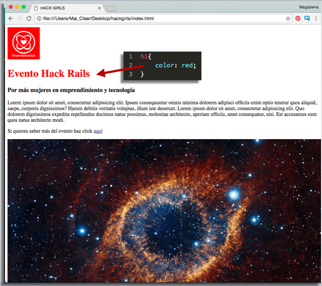


Lo que hace el código anterior es tomar todas las etiquetas tipo `h1` y darles el color rojo. Siempre debes escribir los colores en inglés.

Qué pasa si quiero que toda mi página tenga un color de fondo?
Bueno sabemos que todo el código de nuestra página de encuentra dentro de las etiquetas de `<body>` verdad?

Pues entonces pongámosle un color de fondo:

~~~css
body {
	background-color: #FCFFF0;
}
~~~

Quedando así:


Vemos que ahora tenemos toda la página con un color distinto al por defecto que es blanco.

Nótese también que ahora no se utilizó darle el color nombrándolo, sino que se utilizó el sistema hexagesimal.

## Pseudo clases

Las pseudo clases sirven para definir propiedades en base a el estado de un elemento, estas nos permiten  cambiar las propiedades de una marca cuando el mouse se mueve por encima, o cambiar las propiedades de un link que ya ha sido visitado.

La sintaxis para una pseudo clase es selector:estado

Pseudoselectores para links

| Pseudoselector | Ejemplo |
|----------------|-----------------------------------|
| unvisited link | ``` a:link { color: #FF0000; } ```|
| visited link | ```a:visited { color: #00FF00; } ```|
| selected link | ``` a:active {color: #0000FF;} ``` |

Otros pseudo selectores

| Pseudoselector | Ejemplo |
|----------------|-----------------------------------|
| mouse sobre párrafo | ```p:hover { color: #FF00FF;} ```

## Cambiando las tipografías
Para cambiar la tipografía de una marca debemos ocupar la propiedad font-family

~~~css
body{ font-family: "Times New Roman", Georgia, Serif; }
~~~

font family acepta diversas tipografías simultáneamente a modo de fallback, o sea si una tipografía falla en cargar se cargará la siguiente, si una de los nombres de la tipografía tiene espacios entre medio hay que agregarla entre comillas `""`

## Googlefonts

[https://www.google.com/fonts
](www.google.com/fonts) es una página web que permite cargar de forma sencilla diversas tipografías no tan comunes dentro de tu sitio, 


Para utilizarla debes hacer click en la opción quick use de la fuente respectiva, luego seleccionar los pesos de la fuente.

Importar la fuente dentro del html o dentro del CSS, por ejemplo si quisieramos importar open sans sería

~~~
<link href='https://fonts.googleapis.com/css?family=Open+Sans' rel='stylesheet' type='text/css'>
~~~

y finalmente utilizarla.

~~~
body {font-family: 'Open Sans', sans-serif;}
~~~

## Alineando textos

<div class="warning">
No debes abusar de esto pues cada tipografía agrega un peso extro a tu página haciendola más lenta de cargar.
</div>


#¿Qué es Bootstrap?

Bootstrap es el framework más popular para el desarrollo de sitios responsive en la web, su código es compatible con SaSS y LESS por lo que podemos trabajar en nuestro preprocesador favorito sin problemas, además existen cientos de herramientas y plantillas que podemos integrar directamente con bootstrap.

# Desventajas de bootstrap

Es un framework relativamente pesado, del orden de 50k por lo que integrarlo para hacer simplemente una grilla o algo básico no tiene sentido, por otro para hacer la comparación cualquier imagen o fotografía para un cover pesa más de 100k.
 
Utilizar bootstrap completamente por defecto y no personalizarlo da un toque genérico a la página, hay muchos sitios construidos con este framework por lo que si no lo personalizamos se ve igual a los otros.


#Descargando bootstrap
Hay dos formas, la primera es el CDN, la segunda descargando los archivos.

El CDN consiste simplemente en 2 archivos CSS y un archivo JS que deben ser linkeados en la página.

La descarga en cambio se divide en dos tipos, el precompilado donde vienen los CSS y JS directamente a utilizar y el source que viene con todo lo necesario para modificar el código fuente en LESS o SaSS dependiendo de la versión descargada.

Ejemplo de la estructura de directorio del código en LESS.

<pre>
bootstrap/
├── less/
├── js/
├── fonts/
├── dist/
│   ├── css/
│   ├── js/
│   └── fonts/
└── docs/
    └── examples/
</pre>

<aside class="info"> Un CDN es una especie de página web para descargar contenido, pero está optimizada para la descarga rápida de assets, además que los CDN tienen servidores en diversas partes del mundo disminuyendo el impacto en la velocidad por distancia.
</aside>

#El primer template con bootstrap

~~~html
<!DOCTYPE html>
<html lang="en">
  <head>
    <meta charset="utf-8">
    <meta http-equiv="X-UA-Compatible" content="IE=edge">
    <meta name="viewport" content="width=device-width, initial-scale=1">
    <!-- The above 3 meta tags *must* come first in the head; 
    any other head content must come *after* these tags -->
    <title>Bootstrap 101 Template</title>

    <!-- Bootstrap -->
    <link href="css/bootstrap.min.css" rel="stylesheet">

    <!-- HTML5 shim and Respond.js for IE8 support of 
    HTML5 elements and media queries -->
    <!-- WARNING: Respond.js doesn't work if you view 
    the page via file:// -->
    <!--[if lt IE 9]>
    <script 
      src="https://oss.maxcdn.com/html5shiv/3.7.2/html5shiv.min.js">
    </script>
    <script 
      src="https://oss.maxcdn.com/respond/1.4.2/respond.min.js">
    </script>
    <![endif]-->
  </head>
  <body>
    <h1>Hello, world!</h1>

    <!-- jQuery (necessary for Bootstrap's JavaScript plugins) -->
    <script 
      src="https://ajax.googleapis.com/ajax/libs/jquery/1.11.3/jquery.min.js">
      </script>
    <!-- Include all compiled plugins (below), 
    or include individual files as needed -->
    <script 
      src="js/bootstrap.min.js"></script>
  </body>
</html>
~~~

Para que funcione correctamente debemos tener cuidado de que los archivos CSS y JS se encuentren donde se especifica.

Para detectar si hay conflictos con las rutas que pusimos para los assets de bootstrap podemos utilizar el inspector de elementos en el tab network, ahí podemos ademas escoger un sub tab como CSS, en caso de que un archivo no lo encuentre se mostrará en rojo, esto normalmente indica que la dirección apuntada es incorrecta.


<aside class="warning"> Abrir el tab no es suficiente, hay que recargar la página con el tab network abierto para obtener la información. </aside>

Un error típico que podemos detectar de esta forma es la no inclusión (o la inclusión posterior) de Jquery, el javascript de bootstrap depende de Jquery para su funcionamiento, por lo que no incluirlo o hacerlo después mostrará un error y no funcionará correctamente la capa de javascript de bootstrap.

# Comenzando con bootstrap
Partamos por las componentes básicas.

##Jumbotron
Es una componente lightweight y flexible que permite mostrar texto o imágenes de forma resaltada en el sitio, ideal para la propuesta de valor del landing page

Ejemplo de uso:

~~~html
<div class="jumbotron">
<h1> Yo estoy resaltado </h1>
</div>
~~~

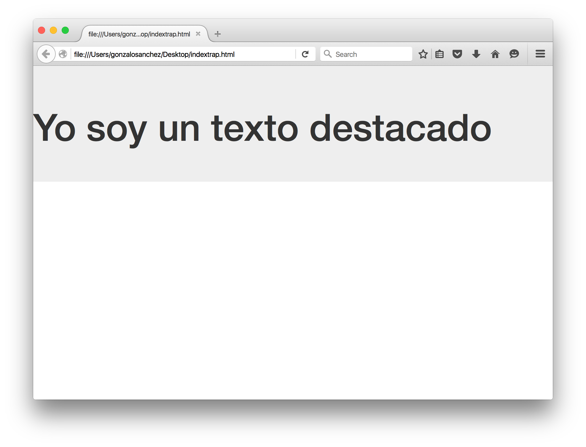

##Page Header
El page-header es otro componente liviano que sirve para títulos de secciones, además puede acompañarse con otro texto de clase small para acompañar el contenido.

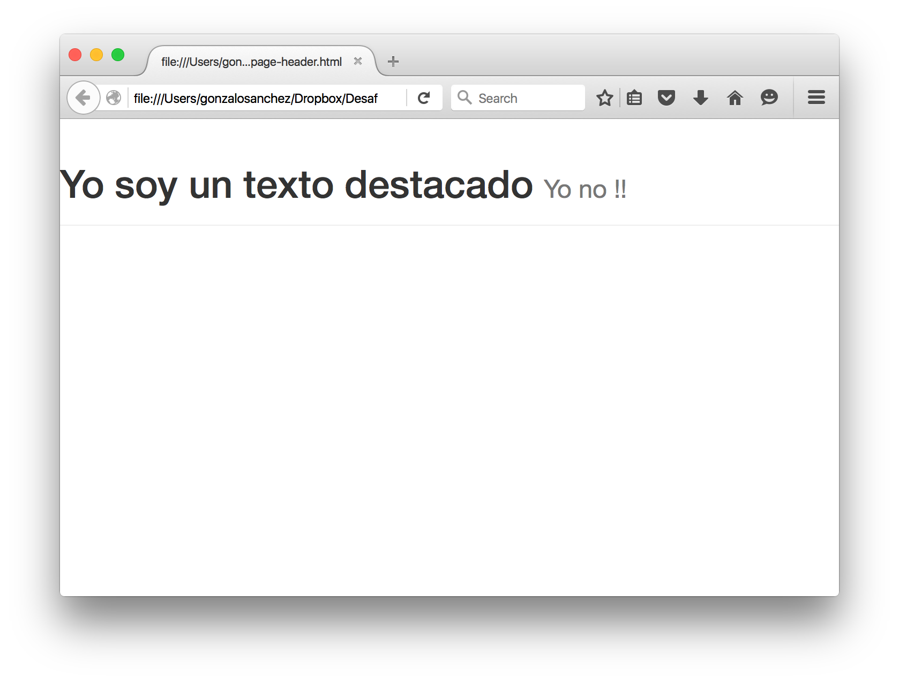

~~~html
<div class="page-header">
	<h1> Yo estoy resaltado <small> Yo no !! </small> </h1>
</div>
~~~

##Container
Es un contenedor que da margen de los bordes del sitio, bastante útil a la hora de mostrar texto.

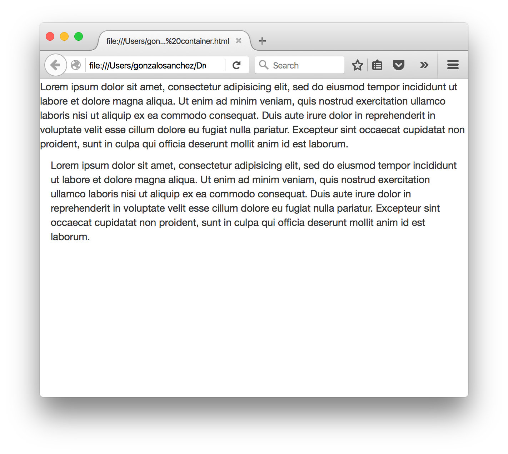

En la imagen vemos dos párrafos uno con container y el otro sin, el que tiene container tiene margen respecto a los bordes de la página.

~~~html
 <p>Lorem ipsum dolor sit amet, consectetur adipisicing elit, sed do eiusmod
 	tempor incididunt ut labore et dolore magna aliqua. Ut enim ad minim veniam,
 	quis nostrud exercitation ullamco laboris nisi ut aliquip ex ea commodo
 	consequat. Duis aute irure dolor in reprehenderit in voluptate velit esse
 	cillum dolore eu fugiat nulla pariatur. Excepteur sint occaecat cupidatat non
 	proident, sunt in culpa qui officia deserunt mollit anim id est laborum. 
</p>
<div class="container">
	<p>Lorem ipsum dolor sit amet, consectetur adipisicing elit, sed do eiusmod
	tempor incididunt ut labore et dolore magna aliqua. Ut enim ad minim veniam,
	quis nostrud exercitation ullamco laboris nisi ut aliquip ex ea commodo
	consequat. Duis aute irure dolor in reprehenderit in voluptate velit esse
	cillum dolore eu fugiat nulla pariatur. Excepteur sint occaecat cupidatat non
	proident, sunt in culpa qui officia deserunt mollit anim id est laborum.
	</p>
</div>
~~~

##Jumbotron y Containers
	
Un jumbotron puede ir dentro de un container y un container puede ir dentro de un jumbotron **No es lo mismo un container dentro de un jumbotron que un jumbotron dentro de un container**, esto es lo que estudiaremos a continuación.


Al ponerle un container el texto se alínea mejor, y aunque esté dentro de un jumbotron un container, y otro container esté fuera sin jumbotron, veremos que ambos textos quedan bien alineados.

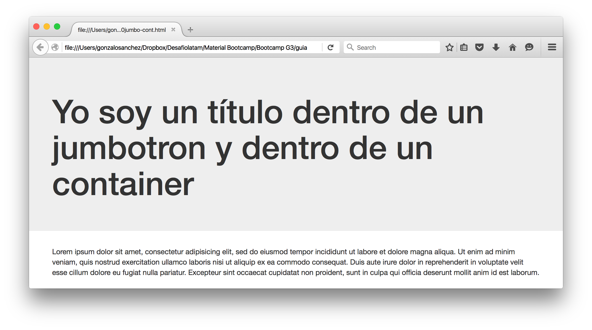

~~~html
	<div class="jumbotron">
		<div class="container">
			<h1> Yo soy un título dentro de un jumbotron y dentro de un container </h1>
		</div>
	</div>

	<div class="container">
	Lorem ipsum dolor sit amet, consectetur adipisicing elit, sed do eiusmod
	tempor incididunt ut labore et dolore magna aliqua. Ut enim ad minim veniam,
	quis nostrud exercitation ullamco laboris nisi ut aliquip ex ea commodo
	consequat. Duis aute irure dolor in reprehenderit in voluptate velit esse
	cillum dolore eu fugiat nulla pariatur. Excepteur sint occaecat cupidatat non
	proident, sunt in culpa qui officia deserunt mollit anim id est laborum.
	</div>
~~~

Algo muy distinto sucede cuando ponemos el jumbotron dentro de un container.

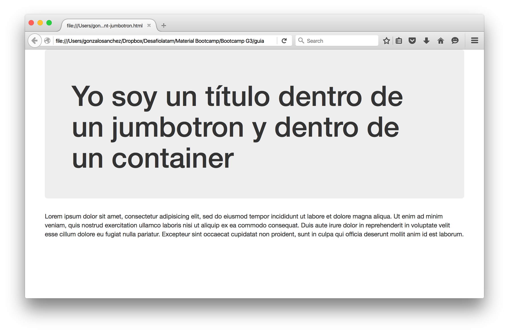

Como vemos en la imagen nos damos cuenta que ahora el jumbotron no está pegado al borde de la página, y además ahora es el borde del jumbotron el que está alineado con el texto de los otros containers.

<aside class="success"> **¿Cuál método utilizar?** <br> Depende de lo que se quiera hacer, todos los métodos previos son correctos </aside>

## Glyphicons

Podemos agregar íconos con la tipografía de glyphicons, por más extraño que suene esto, es común agregar íconos en base a tipografía, donde cada ícono corresponde a una letra distinta, a nosotros esto no nos importará porque ocuparemos nombres que vienen definidos en el css, por ejemplo para agregar una estrella basta con agregar las clases **glyphicon glyphicon-star**

~~~html
<span class="glyphicon glyphicon-star" aria-hidden="true"></span>
~~~

Esto lo podemos envolver dentro de un botón de forma sencilla.

~~~html
<button class="btn btn-default">
    <span class="glyphicon glyphicon-star" aria-hidden="true"> </span>  Click Me
</button>
~~~

La lista de Glyphicons es bastante grande

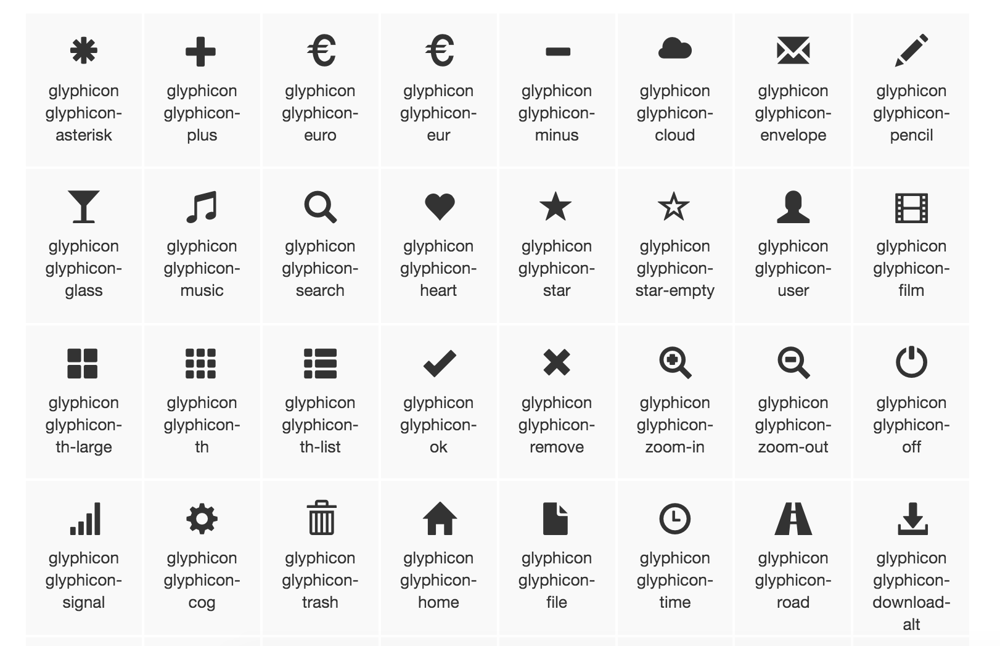

se puede consultar en la: [documtación oficial](http://getbootstrap.com/components/#glyphicons-glyphs)

## Imágenes responsive

Con bootstrap podemos convertir una imagen responsive solo con agregar la clases img-responsive

~~~html 

~~~

`img-responsive` hace que la imagen tenga un **max-width** del 100%, recordemos que la diferencia entre width y max-width es que width altera el tamaño de todos los elementos mientras que **max-width** como dice su nombre afecta solo a los elementos que tienen un tamaño mayor que el espacio que tienen disponible.

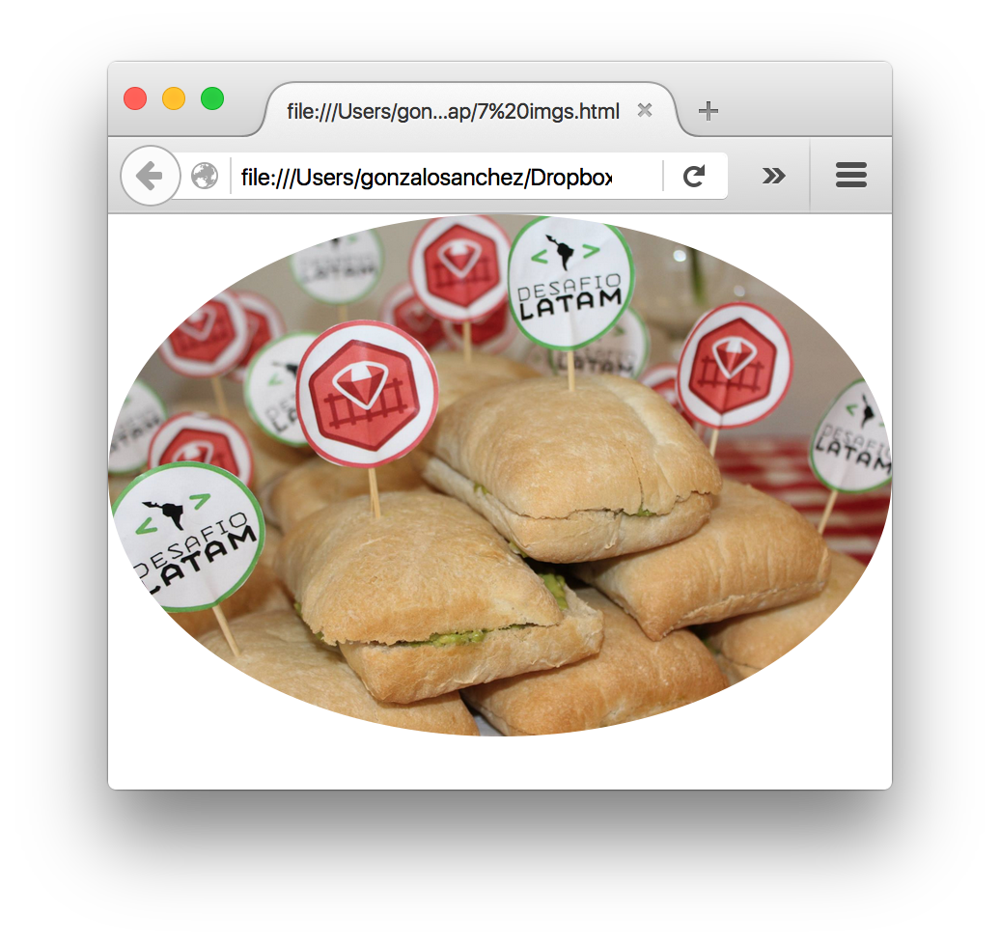

Además hay clases que pueden ayudarnos a darle formas a las imágenes.

~~~html 


~~~

<aside class="warning"> **width vs max-widht** <br> debemos tener cuidado con la propiedad max-width porque esta no cambiará el tamaño de las fotos que son menores al espacio disponible. </aside>
 
## Thumbnails
 
Los thumbnails permiten agregar estilos y bordes de forma sencilla a las imágenes.

~~~html
<div class="thumbnail" style="width:300px">
		

		<p>
		Lorem ipsum dolor sit amet, consectetur adipisicing elit, sed do eiusmod
		tempor incididunt ut labore et dolore magna aliqua. Ut enim ad minim veniam,
		quis nostrud exercitation ullamco laboris nisi ut aliquip ex ea commodo
		consequat. Duis aute irure dolor in reprehenderit in voluptate velit esse
		cillum dolore eu fugiat nulla pariatur. Excepteur sint occaecat cupidatat non
		proident, sunt in culpa qui officia deserunt mollit anim id est laborum.
		</p>
		<button type="" class="btn btn-primary"> Comprar</button>
	
	</div>
~~~

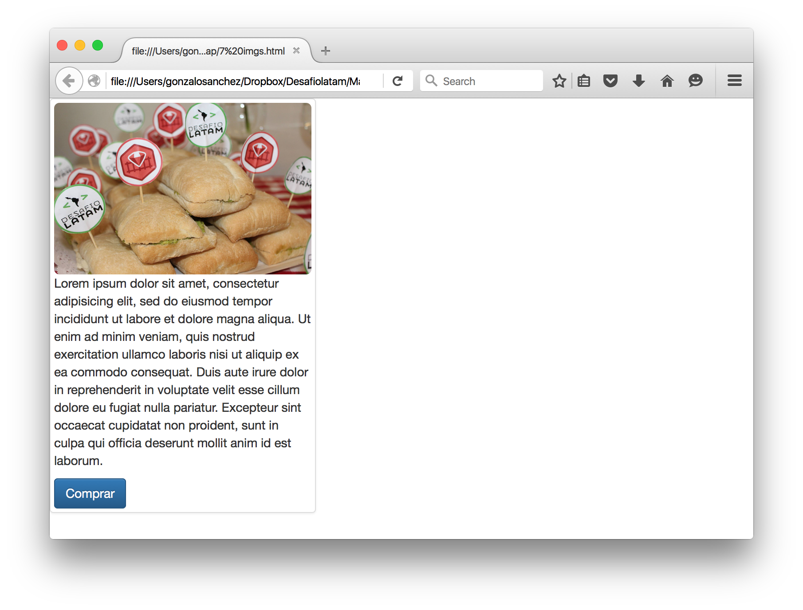

<aside class="info"> **To thumbnail or not to thumbnail** <br>
La clase thumbnail puede aplicarse directamente a la imagen o a un div superior, en caso de aplicarse a la imagen perderemos otras propiedades como el redondeado y no podremos poner otro contenido dentro del thumbnail.
</aside>

##Iframes responsivos

Bootstrap tambien permite convertir iframes en responsive, el proceso es similar pero requiere de dos pasos, en primer lugar al iframe hay que agregarle la clase **embed-responsive-item** en segundo lugar hay que envolver este iframe en otro div, donde se debe especificar las proporciones del iframe.

~~~html
<!-- 16:9 aspect ratio -->
<div class="embed-responsive embed-responsive-16by9">
  <iframe class="embed-responsive-item" src="..."></iframe>
</div>

<!-- 4:3 aspect ratio -->
<div class="embed-responsive embed-responsive-4by3">
  <iframe class="embed-responsive-item" src="..."></iframe>
</div>
~~~

16/9 es mas ancho que alto, algo así como una pantalla de cine,  mientras que 4/3 es un poco más cuadrado, cual utilizar es cosa principalmente de gustos.

##La Grilla

Bootstrap contiene una grilla que permite crear layouts de forma muy sencilla

Para utilizar una grilla lo primero que debemos crear es un row

~~~html
<div class="row">
</div>
~~~

Dentro de este row dispondremos de 12 columnas virtuales que podemos agrupar a nuestro antojo para poner contenido.

~~~html
<div class="row">
	<div class="col-md-6"> 
	</div>
	<div class="col-md-6"> 
	</div>	
</div>
~~~

Dentro de cada una estas columnas podemos agregar todo el contenido que queramos y este contenido se adaptará dentro de las columnas.

Si vamos agregar texto o imagenes sería bueno envolver las columnas en un container.

~~~html
<section class="container">
	<div class="row">
		<div class="col-md-6"> 
		</div>
		<div class="col-md-6"> 
		</div>	
	</div>
</section>
~~~

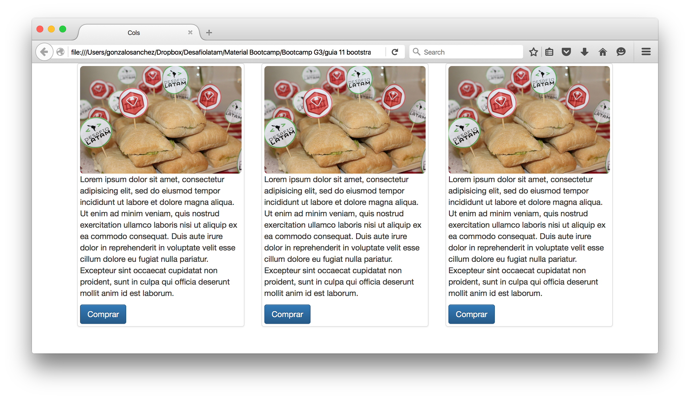


###Mobile First

Bootstrap 3 está construído sobre el concepto de mobile first, esto quiere decir que el primer principio es que la página debe adaptarse al contenido, para eso lo que hace bootstrap es utilizar media queries y desarmar la grilla disponiendo de todo el ancho de la página para presentar su contenido.

A menos que especifiquemos lo contrario.

¿En que repercute esto?

Al disminuir el ancho de la página (o al verda desde un teléfono) veremos que la grilla se rompe.

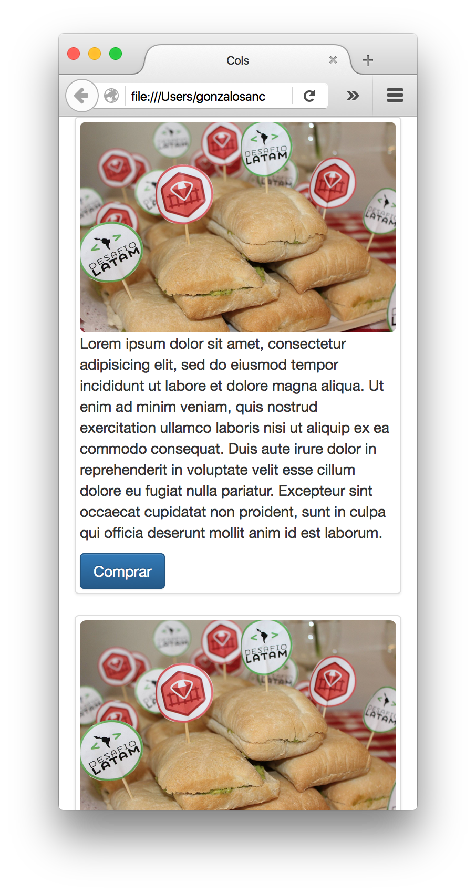

###Media queries
La grilla contiene las siguientes media queries que debemos considerar:

~~~css
/* Extra small devices (phones, less than 768px) */
/* No media query since this is the default in Bootstrap */

/* Small devices (tablets, 768px and up) */
@media (min-width: @screen-sm-min) { }

/* Medium devices (desktops, 992px and up) */
@media (min-width: @screen-md-min) { }

/* Large devices (large desktops, 1200px and up) */
@media (min-width: @screen-lg-min) { }
~~~

###Utilizando columnas para dispositivos específicos

Bootstrap nos permite utilizar columnas especificamente para ciertos dispositivos.

~~~html
<section class="container">
	<div class="row">
		<div class="col-md-6"> 
		</div>
		<div class="col-md-6"> 
		</div>
	</div>
</section>
~~~


