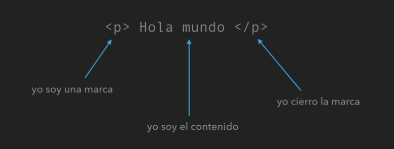
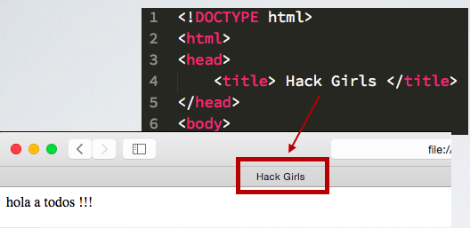
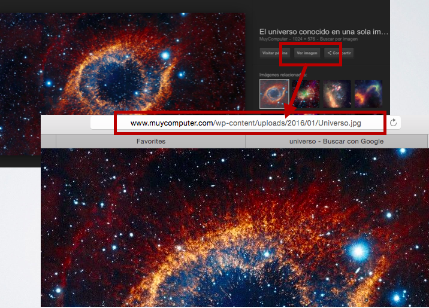
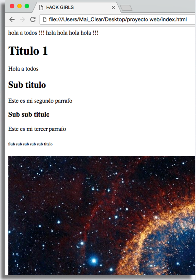
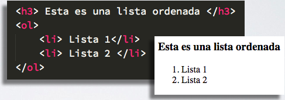
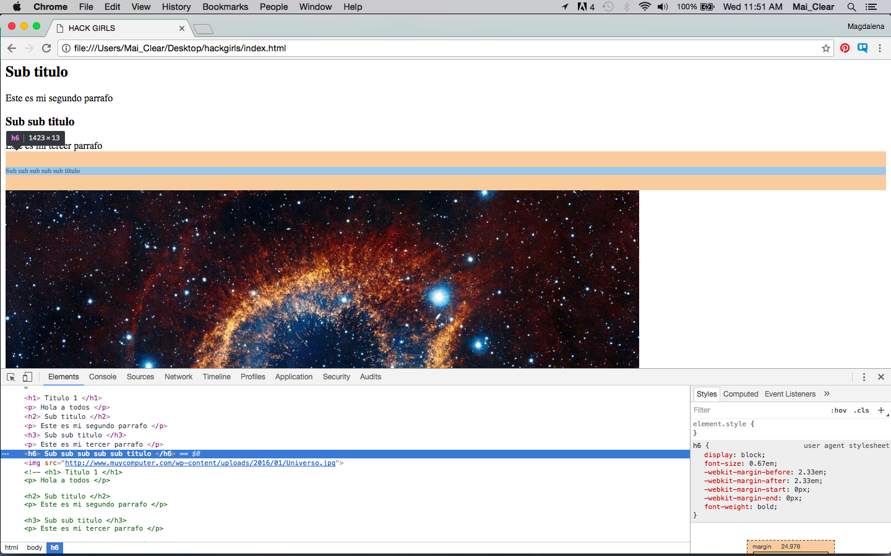
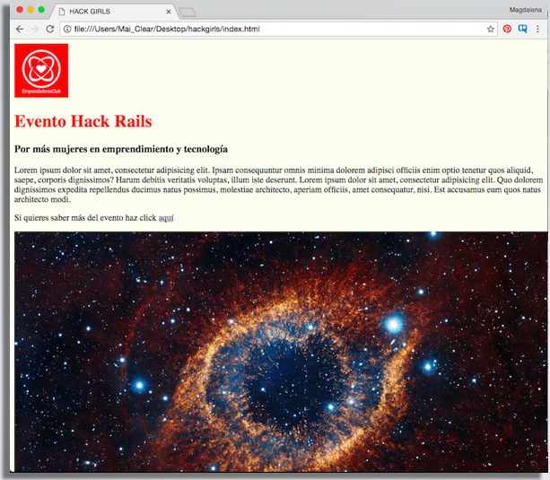

<section class="cover">
#GUÍA HACKGIRLS - FRONT DAY

<pre>

</section>
<section>

#Introducción
para que se hace el evento....blabla
que es lo que se va a ver durante el día, que se logrará al final del día.

#Qué se necesita:
Solo un navegador( puede ser Firefox, Safari, Chrome, etc...) y editor de texto [Sublime Text](https://www.sublimetext.com/) ( u otro).
Descarga Sublime Text [aquí](https://www.sublimetext.com/).

#Qué es una página web
Pues eso de entrada podemos preguntarnos qué es una página web. Habrían dos respuestas: para el **usuario** y para el **diseñador**.

Para el **usuario** una página WEB es una pantalla en su monitor que le muestra la información que va buscando y enlaces a otros sitios relacionados.

Para el **diseñador** una página WEB es un documento construido para mostrar información en la pantalla de un monitor, que contiene además de la información una serie de instrucciones para indicar como se ha de mostrar esa información. Estas instrucciones se escriben siguiendo un lenguaje llamado HTML.

Una serie de páginas web interconectas e interrelacionadas de alguna forma (el mismo tema, el mismo objetivo...) forman un sitio web, que habitualmente está almacenado en un servidor.

#Comenzamos:
Vamos a crear un proyecto totalmente desde cero.
Para eso vamos a crear una carpeta nueva en el escritorio. Le puedes llamar como tu quieras, como por ejemplo "proyecto web".
Luego abrimos la carpeta  "proyecto web" en Sublime Text (tu editor de texto).

- Puede ser arrastrando la carpeta hacia el editor de texto</li>
- O abriéndola desde el editor de texto.</li>

Ahora creamos un archivo nuevo llamado index.html 
Esto se hace escribiendo index.html en la primera línea.

~~~html
index.html
~~~
*Cada vez que salga esta sintaxis en la guía, significa que debes escribir esto en Sublime Text (en el editor de texto).*

Luego guardamos (grabamos).

Una vez guardado, puedes borrar la primera línea. El archivo ya quedó guardado  como index.html.

¿Por qué llamar al archivo de inicio como index?
Porque es una convención, se subentiende que es el archivo índice que inicia una página web.

El que sea .html, dice que es un archivo que se interpretará como HTML.
Ahora este archivo puedes abrirlo en tu navegador haciendo click con el botón derecho sobre el nombre y eligiendo la opción "Open in browser"/"Abrir en navegador", pero antes de hacerlo escribe en él "hola a todos !!!".

~~~html
hola a todos !!!
~~~

Entonces al abrirlo en el navegador te debería aparecer algo como esto:

Felicidades!!	Ya estás escribiendo tu primera página web!!!

#¿Qué es HTML?
***

HTML es un simple código que es interpretado por el navegador web - como Chrome, Firefox o Safari - para mostrar una página web al usuario.

HTML significa "HyperText Markup Language" - en español, **Lenguaje de Marcas** de HyperTexto. **HyperText** significa que es un tipo de texto que soporta hipervínculos entre páginas. **Marcado** significa que hemos tomado un documento y lo marca con código para decirte cómo interpretar la página (en este caso, un navegador).

HTML es un lenguaje de **marcas**, cada una comenzando con `<` y terminando con `>`. Estas etiquetas definen **propiedades**, la **importancia** y el **significado semántico** del contenido que envuelven.

Una página web entonces es un archivo que contiene un conjunto de marcas ó etiquetas y que el navegador lee estos archivos HTML y con eso mostrar las páginas.

## Estructura de HTML
HTML tiene una **cabeza** (*head*) y un **cuerpo** (*body*), la cabeza contiene toda la información que es para el **navegador**, el cuerpo de la página contiene toda la información que es para el **usuario**. Dentro de las etiquetas HTML se encuentra todo el contenido de la página, y dentro de ellas están los dos bloques previamente mencionados.

La estructura de una página en HTML es la siguiente:

~~~html
<!DOCTYPE html>
<html>
<head>
	<title></title>
</head>
<body>
    <!-- Aquí va el contenido de la página web -->
</body>
</html>
~~~

El `doctype` (o tipo de documento) es la primera etiqueta que leeremos y le indica al navegador como debe interpretar el resto del documento. En el ejemplo veremos que el doctype especificado es de HTML5, el cuál es el estándar de hoy. 

La etiqueta `<html>` especifica que desde ese punto en adelante todo lo que venga deberá ser interpretado como HTML.

En HTML5 la etiqueta `<head>` puede ser omitida, en ese caso todo lo que esté antes de body será considerado como head. Por otro lado, esta es una etiqueta que especifica el contenido que se le entregará al navegador y que sea necesario para mostrar correctamente la página. Contendrá información variada, desde dónde encontrar las hojas de estilo o los íconos, hasta cuál es el título del sitio o sencillamente cómo debe manejar la página en el caso de que tenga que adaptarse a distintos tamaños de pantalla.

##El título
Muestra en el navegador el título de la página, se escribe entre las marcas `<title>` y `</title>` y tiene la función de ser una guía visual del contenido de la ventana o del tab del navegador.

~~~html
<!DOCTYPE html>
<html>
<head>
	<title> HACK GIRLS </title>
</head>
<body>
    <!-- Aquí va todo lo que quieras agregar -->
</body>
</html>
~~~

Cabe destacar que Los bookmarks ocupan el título de la página cuando se guarda, además tiene mucho valor en el SEO de un sitio web.

##Codificación
Agregaremos la codificación (standard que define el cómo se muestran las letras en el html) para que el navegador muestre los textos correctamente y entienda cuando hemos agregado una letra distinta, como por ejemplo la ñ. Para agregar esto hay que agregar la siguiente línea dentro de las marcas `<head>` `</head>` :

`<meta charset="utf-8">`

La página debería quedar así:

~~~html
<!DOCTYPE html>
<html>
<head>
	<title> HACK GIRLS </title>
    <meta charset="utf-8">
</head>
<body>
    <!-- Aquí va todo lo que quieras agregar -->
</body>
</html>
~~~

 Sin el meta charset los tildes y ñ (caracteres especiales) no se verán correctamente dentro de nuestro documento 

##Atributos y valores
En la etiqueta `<meta charset="utf-8">` vemos que hay algo nuevo que no habíamos visto en otras etiquetas, en primer lugar la marca no se cierra, y la regla es simple, si la etiqueta no tiene contenido no se cierra, y para pasarle valores adicionales se ocupan **atributos** y **valores**, donde `charset` sería el *atributo* y `utf-8` el *valor*.

Son diversos los atributos y valores que se pueden pasar a cada etiqueta, dos atributos muy importantes que estudiaremos más adelante son el **id** y la **clase**.

##Cabeza y cuerpo
La información de la página dentro del head es para el navegador, la información que está dentro del cuerpo es para el usuario. 

El navegador lee dentro de ambas etiquetas, pero las del head no las muestras, las ocupa para determinar ciertos parámetros, en cambio el body se lo muestra al usuario.

##Etiquetas Básicas:

*Todo lo que veremos desde ahora se debe escribir dentro del* **body** *(hasta que se indique lo contrario), por ende dentro de las etiquetas* `<body>``</body>`

###Párrafos:

Si escribes en el archivo index.html :

~~~html
<!DOCTYPE html>
<html>
<head>
	<title> HACK GIRLS </title>
    <meta charset="utf-8">
</head>
<body>

hola a todos !!!
hola hola hola
hola !!!

</body>
</html>

~~~

Al refrescar el navegador, éste te leerá de la siguiente forma:

Si te fijas, el navegador no respeta la sintaxis de párrafos y se lee como si estuviera todo escrito en una misma línea.
Lo que pasa es que HTML es un lenguaje de marcas y para separar cada línea del texto y se pueda leer todo en varias líneas, deben de existir etiquetas de por medio.
Vamos a aprender la primera etiqueta y la más sencilla de todas: `p`.

Se abre con `
` y debido a que contiene información se debe cerrar con `
`.
Todo el contenido que se encuentre dentro de estas marcas pasa a tener la **propiedad de párrafo**.
Por ejemplo, escribamos esto en nuestro archivo index.html:

~~~html
hola a todos !!!
hola hola hola
hola !!!

 Hola a todos 

 Este es mi segundo párrafo 

~~~
*No olvidar que esto se escribe dentro del body.*

Refrescamos el navegador y quedaría algo así:

Ves, ahora **si** respeta que sea un párrafo!!!
Puedes agregar la cantidad y largo que quieras.

 En Sublime Text si se escribe "p" (o cualquier marca) y luego tab, se autocompleta la etiqueta por si sola. 

###Titulares (Títulos) y Sub titulares:

Una página web también tiene títulos!
La marca para los títulos es `<h>` **más** un número del `1` al `6`. Siendo `<h1>` para el título principal o con mayor importancia y `<h6>` para el subtítulo del subtítulo del subtítulo del subtítulo del subtítulo del título!

Por ejemplo escribamos en nuestro archivo index.html:

~~~html
hola a todos !!!
hola hola hola
hola !!!

<h1> Titulo 1 </h1>

 Hola a todos 

<h2> Sub titulo </h2>

 Este es mi segundo parrafo 

<h3> Sub sub titulo </h3>

 Este es mi tercer parrafo 

<h6> Sub sub sub sub sub titulo </h6>

~~~

Refrescamos el navegador y se debería ver algo como esto:

Se puede ver que el titular `<h6>` es muy pequeño, incluso menor que los párrafos.

### Imágenes:

La etiqueta para agregar imágenes es

~~~html

~~~

Donde `src` es *source* , que en español es fuente y que es un **atributo** de la etiqueta de imagen. `alt` es otro **atributo** de la etiqueta `img`, que te permite describir(brevemente) la imagen en caso de que no se pueda cargar por escasez de internet, o en navegadores de solo texto.
Esta etiqueta no necesita cerrarse como lo hacen las anteriores.
	
Para agregar imágenes utilizando esa etiqueta puedes hacerlo de dos maneras:
`-`Directo de una URL de internet.
`-`Desde una imagen desde tu proyecto (desde tu computador).

##### Imágenes Desde internet:

Buscas en el google la imagen que quieras, y luego haciendo click en "ver imagen" , ésta te llevará a una url terminada en .jpg o .png 

Esa url debes copiarla y pegarla dentro de los `" "` del source

~~~html

~~~
Entonces si esto lo agregamos en nuestro archivo index.html:

~~~html
hola a todos !!!
hola hola hola
hola !!!

<h1> Titulo 1 </h1>

 Hola a todos 

<h2> Sub titulo </h2>

 Este es mi segundo parrafo 

<h3> Sub sub titulo </h3>

 Este es mi tercer parrafo 

<h6> Sub sub sub sub sub titulo </h6> 

~~~

Refrescamos el navegador:

#####Imágenes desde el computador:

Para esto debes crearte una carpeta **dentro** de tu proyecto llamada *images* y ahí ir integrando las imágenes que quieres en tu proyecto:

~~~
proyecto_web
└───index.html
	images
    └─── ejemplo.jpg          
~~~
*Puede ser formato jpg, png, jpeg, ahí debes ver que formato es tu imagen. Importante que las imágenes estén en una carpeta que se llame images dentro de la carpeta de donde está tú proyecto*

En ese ejemplo yo estoy agregando una imagen a mi carpeta *images* con el nombre de *ejemplo* y de formato *.jpg*

Entonces para agregarla en mi web se copia la ruta de donde se encuentra mi imagen en el `src` de la siguiente manera:

~~~html

~~~

Donde *images* es el nombre de la carpeta donde se encuentra mi imagen + `/` + *ejemplo* (nombre de mi imagen) `.jpg`(formato)

###Links:

Los links se hacen con la etiqueta `<a>`:

~~~html

~~~
Esta etiqueta es un poco distinta a las demás, es una copia entre la de imágenes y las anteriores, ya que esta **si** se cierra.
Siendo `href` el lugar donde se pone la página web donde apunta el contenido (link de referencia), y es un **atributo** de la etiqueta `<a>`
Por ejemplo:

~~~html
<a href="https://www.facebook.com/events/2162321913993416/">Link al evento</a>
~~~
Aquí se está transformando a la frase *Link al evento* en un hipervínculo. Y al hacerle *click* en ella , te enviará al link escrito dentro de las `" "` del `href`

Por ende lo que hace esta etiqueta es darle la **propiedad de hipervínculo** al contenido de ésta, apuntándolo al link que se encuentra en `href`

Si pongo link sin `href`, no me llevará a ninguna parte. Y si al link no le pongo texto(contenido) ,pero si `href`, no se podrá ver el link por ninguna parte y por ende no se podrá hacer nada.

Si yo quisiera que el link me abriera en una página nueva, hay que agregarle a la etiqueta el **atributo** `target="_blank"`, quedando de esta forma:

~~~html
<a href="https://www.facebook.com/events/2162321913993416/" target="_blank" > Link al evento </a>
~~~

*Importante resaltar que todos los* **atributos** (`href` , `target`, etc...) *se escriben dentro de la etiqueta `< ... >` no fuera, ya que pasaría a ser texto.*

Ahora trata de transformar una imagen en hipervínculo.
Si necesitas ayuda, no dudes en preguntar a tu mentor.
  

	

***

Hagamos un pequeño resumen de lo que hemos aprendido:

~~~html
<!DOCTYPE html>
<html>
<head>
	<title> HACK GIRLS </title>
    <meta charset="utf-8">
</head>
<body>

<h1> Evento Hack Rails </h1>

<h3>Por más mujeres en emprendimiento y tecnología</h3>

 Lorem ipsum dolor sit amet, consectetur adipisicing elit. 
Ipsam consequuntur omnis minima dolorem adipisci officiis enim 
optio tenetur quos aliquid, saepe, corporis dignissimos? 
Harum debitis veritatis voluptas, illum iste deserunt.
Lorem ipsum dolor sit amet, consectetur adipisicing elit. 
Quo dolorem dignissimos expedita repellendus ducimus natus 
possimus, molestiae architecto, aperiam officiis, amet consequatur,
 nisi. Est accusamus eum quos natus architecto modi.

 Si quieres saber más del evento haz click <a href="https://www.facebook.com/events/2162321913993416/" target="_blank" >aquí </a>

</body>
</html>

~~~

Esto se vería así:

- Primero se está llamando una imagen que se encuentra dentro de la carpeta *images* y que se llama *logo_emp*.
- Luego se pone un título `<h1>`(Titular principal).
- Luego un sub sub título.
- Luego viene un párrafo con bastante texto.
- Luego un párrafo que a su vez con tiene un link (`<a>`).
- luego se llama a una imagen desde el internet.

### listas ordenadas:
Para definir una lista de elementos ordenados ocuparemos la etiqueta `<ol>`, pero dentro de esta lista debemos definir elementos, eso lo haremos con la etiqueta `<li>` 

Las listas ordenadas tienen un número o letra, esto lo modificaremos más adelante con CSS.

~~~html
<h3> Esta es una lista ordenada </h3>
<ol>
	<li> Lista 1 </li>
	<li> Lista 2 </li>
</ol>

~~~

###listas desordenadas:

Las listas desordenadas tienen bullets, esto también es modificable con CSS.
Para definir una lista de elementos desordenados ocuparemos la etiqueta `<ul>`, y dentro de esta lista debemos definir elementos, eso lo haremos con la etiqueta `<li>` 

~~~html
<h3> Esta es una lista desordenada </h3>
<ul>
  <li> Lista 1 </li>
  <li> Lista 2 </li>
</ul>
~~~

###Tablas

Es posible agregar tablas con datos ocupando la etiqueta `<table>`, dentro de una tabla debemos especificar las filas y las celdas dentro de las filas utilizando `<tr>` y `<td>` cada etiqueta tr especifica una nueva fila, y cada etiqueta td una celda.

~~~html
<table>
<tr>
<td> Celda 1</td>
<td> Celda 2</td>
</tr>

<tr>
<td> Celda 3</td>
<td> Celda 4</td>
</tr>

</table>
~~~

<table>
<tr>
<td> Celda 1</td>
<td> Celda 2</td>
</tr>

<tr>
<td> Celda 3</td>
<td> Celda 4</td>
</tr>

</table>
###Divs:
Los divs son etiquetas que permiten anidar a otras etiqueta y le damos estilo propio a la agrupación (esto lo haremos más adelante con CSS).
Envuelve varias etiquetas, y todas las etiquetas envueltas por él, están bajo la influencia del div.

~~~html

	<h1> Titular 1 </h1>
	<h2> Titular 2 </h2>
	
 Párrafo 1 

~~~

###Span:

La etiqueta span es similar a los divs pero sirve para etiquetar texto, una parte de una palabra, una palabra o más. (luego con CSS, hace más sentido, por ahora es bueno que la conozcas)

~~~html

 Lorem  Ipsum  

~~~

##El inspector de elementos
El inspector de elementos, es una herramienta que podemos abrirla haciendo click derecho sobre la página y luego inspect nos muestra el código completo de la página y nos permite modificarlo. Con esta herramienta pueden ver el código de cualquier página web. 

Puedes aprender más sobre él [aquí](https://developer.mozilla.org/es/docs/Tools/Page_Inspector)

Juega un rato con él, inspecciona lo que llevas de tu página, y mira sitios de tu interés.

	

***
Ahora vamos a saltar al diseño de nuestra página web, luego continuaremos con más html.

Nosotros estábamos aprendiendo HTML, que vendría siendo el esqueleto de nuestro sitio web, ahora le añadiremos la "piel", el diseño, y eso lo hacemos con CSS.

#¿Qué es CSS?
CSS es acrónimo de Cascading Style Sheet, o sea hojas de estilo que se pueden incorporar dentro de HTML para darle forma y color a nuestra voluntad.

Hay tres formas de incorporar CSS dentro de una página web.

- La primera es con un conjunto de atributos y valores dentro de la etiqueta del mismo HTML.

- La segunda consiste en agregar el CSS dentro del head del mismo documento HTML.

- La tercera forma consiste en utilizar un archivo externo.

Pero en esta guía solo veremos la tercera forma, por archivo externo.

##Cargando un CSS externo:
La tercera forma para incluir CSS en una página web consiste en agregar un link a un CSS externo, con externo se refiere a fuera de la página, pero puede estar dentro del mismo servidor, o se puede cargar desde otro sitio.

Primero creamos un archivo nuevo, dentro de la carpeta de nuestro proyecto, llamado miestilo.css 

~~~
proyecto_web
└───miestilo.css
	index.html
	images
    └─── ejemplo.jpg          
~~~
El nombre no importa, lo importante es que sea `.css` para que sepa que estamos escribiendo CSS.

Para agregar un link a un css ocuparemos la etiqueta link dentro del `<head>`.

~~~html
<link rel="stylesheet" type="text/css" href="miestilo.css">
~~~

 En Sublime Text si se escribe link y luego se autocompleta con tab, la línea para agregar un CSS externo se escribe sola. 

Quedando de esta manera:

~~~html
<!DOCTYPE html>
<html>
<head>
	<title> HACK GIRLS </title>
    <meta charset="utf-8">
    <link rel="stylesheet" type="text/css" href="miestilo.css">
</head>
<body>
.
.
.
</body>
</html>
~~~

Con esto estamos agregando el CSS del archivo miestilo.css a nuestra página web.

##Sintaxis:
Se escribe en el archivo de `.css`:

~~~css
etiqueta {
	propiedad: valor;
}
~~~
####Color:

Por ejemplo empecemos por cambiarle el color a la letra de algún título.

Tomando lo anterior:

~~~html
<!DOCTYPE html>
<html>
<head>
	<title> HACK GIRLS </title>
    <meta charset="utf-8">
    <link rel="stylesheet" type="text/css" href="miestilo.css">
</head>
<body>

<h1> Evento Hack Rails </h1>

<h3>Por más mujeres en emprendimiento y tecnología</h3>

 Lorem ipsum dolor sit amet, consectetur adipisicing elit. 
Ipsam consequuntur omnis minima dolorem adipisci officiis enim 
optio tenetur quos aliquid, saepe, corporis dignissimos? 
Harum debitis veritatis voluptas, illum iste deserunt.
Lorem ipsum dolor sit amet, consectetur adipisicing elit. 
Quo dolorem dignissimos expedita repellendus ducimus natus 
possimus, molestiae architecto, aperiam officiis, amet consequatur,
 nisi. Est accusamus eum quos natus architecto modi.

 Si quieres saber más del evento haz click <a href="https://www.facebook.com/events/2162321913993416/" target="_blank" >aquí </a>

</body>
</html>

~~~
Para cambiarle el color a todo el contenido del título `<h1>`

~~~css
h1 {
	color: red;
}
~~~
*Esto se escribe en el archivo de css `miestilo.css`.*

Lo que hace el código anterior es tomar todas las etiquetas tipo `h1` y darles el color rojo. Siempre debes escribir los colores en inglés.

Qué pasa si quiero que toda mi página tenga un color de fondo?
Bueno sabemos que todo el código de nuestra página de encuentra dentro de las etiquetas de `<body>` verdad?

Pues entonces pongámosle un color de fondo:

~~~css
body {
	background-color: #FCFFF0;
}
~~~

Quedando así:

Vemos que ahora tenemos toda la página con un color distinto al por defecto que es blanco.

Nótese también que ahora no se utilizó darle el color nombrándolo, sino que se utilizó el sistema hexagesimal.

</section>

